# Oxidized Architecture Guide

This document gives contributors a high-level and practical overview of how
Oxidized works under the hood. It includes links to code, key flows, and
inline Mermaid diagrams to help you get oriented fast.

- Target audience: developers/contributors
- Prereqs: Rust, terminal UI basics

See also: [Architecture Quickstart (At a Glance)](./ARCHITECTURE_QUICKSTART.md)
for a one-page visual overview.

## Top-level Modules

- src/core: [buffer](../src/core/buffer.rs), [editor](../src/core/editor.rs),
  [mode](../src/core/mode.rs), [window manager](../src/core/window.rs)
- src/ui: [renderer](../src/ui/renderer.rs) + [terminal glue](../src/ui/terminal.rs)
- src/input: [event loop](../src/input/event_driven.rs),
  [key handling](../src/input/keymap.rs), [event types](../src/input/events.rs)
- src/features: [syntax highlighting](../src/features/syntax.rs),
  [syntax manager](../src/features/syntax_manager.rs),
  [search](../src/features/search.rs), [macros](../src/features/macros.rs),
  [text objects](../src/features/text_objects.rs), [LSP (stub)](../src/features/lsp.rs)
- src/config: editor/theme/keymap config + [file watchers](../src/config/watcher.rs)

### Component responsibilities (quick map)

- [core/buffer.rs](../src/core/buffer.rs)
  - Text storage as Vec<String> lines, cursor Position, selection, marks,
    clipboard.
  - Editing operations (insert/delete/indent/unindent/replace), undo/redo with
    delta tracking.
  - File IO (load/save), line ending handling, modified flag.
- [core/editor.rs](../src/core/editor.rs)
  - Orchestrates buffers, window manager, UI, terminal, input handling,
    search, macros.
  - Holds config and theme state, event-driven SyntaxManager (single worker),
    completion engine, and flags for redraw.
  - Produces EditorRenderState for the UI on each render.
- [core/window.rs](../src/core/window.rs)
  - WindowManager and Window data structures: splits, sizes, active window,
    viewport, horizontal offset.
  - Reserved rows for status line and command line.
- [ui/renderer.rs](../src/ui/renderer.rs) + [ui/terminal.rs](../src/ui/terminal.rs)
  - Terminal abstraction with double-buffered queueing of draw commands.
  - Renderer computes gutter, wrapping, statusline, and draws highlighted text
    (from Editor state).
  - Grapheme-aware widths and safe UTF-8 slicing.
- [input/event_driven.rs](../src/input/event_driven.rs) +
  [input/events.rs](../src/input/events.rs) + [input/keymap.rs](../src/input/keymap.rs)
  - EventDrivenEditor: input thread, config watcher, direct SyntaxReady
    events from SyntaxManager worker (dispatcher thread removed).
  - Key handling maps key sequences to editor actions and Ex commands.
- [features/syntax.rs](../src/features/syntax.rs)
  - Tree-sitter integration utilities and base highlighter helpers.
- [features/syntax_manager.rs](../src/features/syntax_manager.rs)
  - Event-driven worker performing full parse + incremental single-edit
    reparses; per-line state machine (Uninitialized/Pending/Ready/Stale) and
    direct EditorEvent::SyntaxReady emission (no dispatcher / LRU cache).
- [features/search.rs](../src/features/search.rs),
  [features/macros.rs](../src/features/macros.rs),
  [features/text_objects.rs](../src/features/text_objects.rs), completion:
  [engine](../src/features/completion/engine.rs) ·
  [presenter](../src/features/completion/presenter.rs) ·
  [providers](../src/features/completion/providers.rs)
  - Focused subsystems used by Editor and keymaps.
- [utils/command.rs](../src/utils/command.rs)
  - Ex-style command parser and executor, centralized :set handler (ephemeral
    vs persistent via :setp).
- config/* (e.g. [config/editor.rs](../src/config/editor.rs),
  [config/theme.rs](../src/config/theme.rs),
  [config/keymap.rs](../src/input/keymap.rs))
  - EditorConfig, ThemeConfig, Keymap config, file watcher, and hot reload
    hooks.

## Key Runtime Flow

1. main.rs initializes logging and creates an Editor.
2. EventDrivenEditor wraps Editor and spawns threads (input, config watch) and
  a single syntax worker owned by SyntaxManager. The worker sends direct
  SyntaxReady events that cause the main loop to poll batched results and
  request UI redraws.

### Timing and Cadence

- The input thread uses crossterm polling with EVENT_TICK_MS (default 16ms) to
  stay responsive. The main event loop uses a fully blocking recv and wakes
  only when events arrive. The config watcher blocks on filesystem events. A
  dedicated syntax worker thread (SyntaxManager) receives jobs and emits
  SyntaxReady events directly (no dispatcher thread).

1. Input thread reads terminal events and sends Input events.
2. EventDrivenEditor processes events, mutates Editor as needed, and sends UI
  RedrawRequest when state changes.
3. Syntax worker performs (incremental) parse + span extraction, sends a
  SyntaxReady event; main thread polls all ready line results and updates
  per-line states.
4. Editor::render() snapshots EditorRenderState and asks UI to draw via
  Terminal.

Sequence (input → state → render):

Mermaid (rendered):

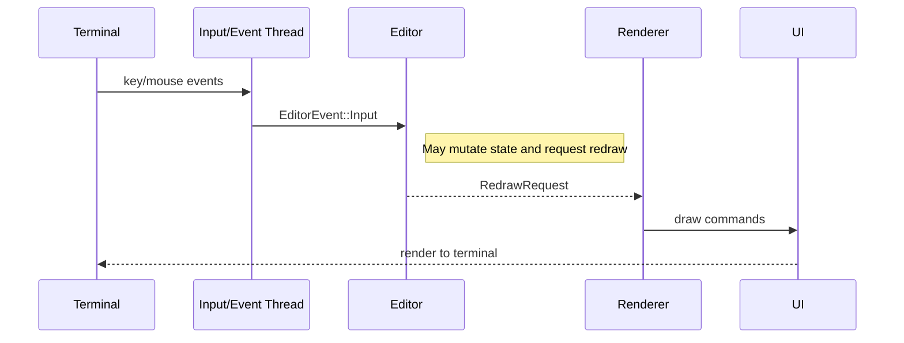

## Data Model

- Buffer: lines, cursor, selection, undo/redo stacks, marks, clipboard.
- Editor: buffer set, window manager, mode, status, config, themes, syntax
  manager state.
- UI: theme, syntax theme, flags; computes gutter/columns; renders
  status/command lines.
- Events: strongly-typed enums for
  Input/UI/Config/Window/Search/Macro/System/LSP.

Component overview (simplified):

Mermaid (rendered):

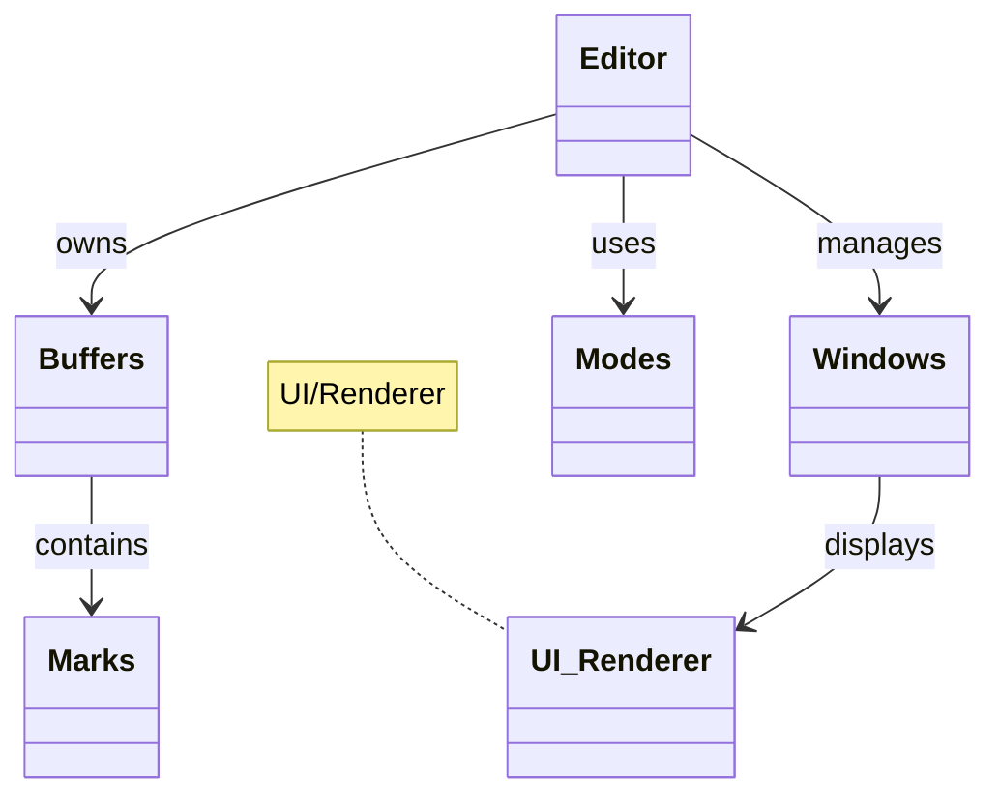

Core classes and relationships (high-level):

  Buffer <--> Editor <--> WindowManager
      ^            |
      |            v
     Marks       Mode

## Rendering and Cursor

- UI::compute_gutter_width reserves space for numbers or marks.
- Rendering is width-aware using unicode-width; grapheme navigation/deletion
  uses unicode-segmentation.
- Cursor column (no-wrap) uses Unicode width between base offset and cursor
  byte index to keep visual and logical positions in sync.
- Visual selection semantics: `Selection.start` is always the anchor (original
  point where selection began) and is not reordered with `end` for
  character/block selections. Helpers like `highlight_span_for_line` and
  `Buffer::get_selection_range` derive ordered spans as needed. This preserves
  direction for motions and anchor-sensitive operations.

## Undo/Redo and Redraws

- Buffer implements delta-based undo/redo; Editor actions call
  buffer.undo()/redo().
- To ensure immediate UI feedback even when the cursor doesn’t move, key
  handlers request redraw after successful delete/undo/redo operations.

## Config & Hot Reload

- ConfigWatcher blocks on filesystem events (notify) and sends typed change
  events; no periodic polling. EventDrivenEditor translates them to Config
  events and forces a full redraw when applied.
- ThemeConfig load_with_default_theme applies color scheme; UI reads it on
  init and reload.

## Syntax Highlighting (event-driven incremental)

Oxidized now uses a single event-driven SyntaxManager powered by Tree-sitter:

- A worker thread owns parsers and receives batched ParseAndExtract jobs with
  (buffer_id, version, needed line indices, full text, language).
- It attempts a fast incremental reparse for single contiguous edits; on
  complex changes it falls back to a full parse.
- Global highlight spans are collected once (shortest-first conflict
  resolution). Requested lines are sliced from that global set and returned as
  per-line results (Line / LineUnchanged messages) plus metrics (incremental
  vs full vs reused counts).
- Worker emits EditorEvent::SyntaxReady. The main loop polls all ready
  results, promoting Pending lines to Ready and marking Stale lines when
  necessary (e.g. empty/mismatched output) and then schedules a redraw.
- Previous Ready spans remain visible while a line is Pending; this removes
  the need for a separate LRU cache and avoids flicker.

Priorities

- Critical: current cursor line
- High: visible viewport lines
- Medium/Low: nearby lines off-screen or opportunistic background work

Versioning and staleness

- Editor maintains highlight_version (AtomicU64). Actions that reshuffle
  context (scroll, resize, theme change) bump the version. Any result with a
  version lower than the current is discarded by the dispatcher.

Caching

- A small LRU cache bounds memory usage for per-line highlight results. The UI
  renders using cached results immediately when available, and async results
  update the cache in-place.

### End-to-end flow (code pointers)

- Editor::render ensures visible lines are scheduled (ensure_lines) and then
  reads any Ready spans already received (immediate rendering for reused
  lines).
- features/syntax_manager.rs: worker_loop performs parse, incremental edit
  diffing (tree.edit), span collection, and message emission.
- input/event_driven.rs: On SyntaxReady, editor.poll_results() drains all
  line results, updates per-line state machine, sets needs_syntax_refresh and
  triggers redraw.
- ui/renderer.rs
  - Uses EditorRenderState.syntax_highlights map (collected by
    Editor::render) to render colored segments. Highlight ranges are shifted
    for wrap and horizontal scrolling.

### Why parse once then slice lines?

- Parsing the full buffer once and slicing spans for requested lines removes
  redundant parses, keeps correctness for multi-line constructs, and still
  allows lazy expansion (request more lines when scrolled).

### Per-line state machine vs LRU cache

- Instead of an external LRU cache, each line tracks a state:
  - Uninitialized: no spans yet (schedule on demand)
  - Pending: worker in-flight; previous Ready spans (if any) are reused
  - Ready: current spans to render
  - Stale: previous spans known outdated; scheduler prioritizes refresh
- This collapses caching + scheduling into a unified structure, avoids
  eviction churn, and eliminates flicker during rapid edits.

## Windows and Viewports

- WindowManager manages splits, sizing, and viewport for each window.
- EditorRenderState contains per-buffer highlight cache keyed by
  (buffer_id, line_index).

## Testing

Oxidized uses a broad, fast test suite emphasizing small, deterministic unit
tests with a few higher-level integration/regression cases. The goals are: (1)
protect core editing invariants (buffer text, cursor/selection semantics,
undo/redo), (2) lock in motion/text-object behavior (including tricky Unicode
and punctuation edges), and (3) ensure peripheral subsystems (config reload,
search, macros, completion, syntax enqueue logic) remain stable.

### Layout & Categories

tests/ contains almost all tests (crate-level integration style) organized by
concern:

- Buffer & Editing: `buffer_integration.rs`, `buffer_range_tests.rs`,
  `buffer_yank_put_tests.rs`, deletion / paste corner cases.
- Cursor & Grapheme Safety: `grapheme_cursor_tests.rs` (emoji, multi‑grapheme
  clusters) plus selection span tests.
- Motions & Modes:
  - Classic motions: covered across `g_motion_tests.rs`,
    `g_caret_motion_tests.rs`, `mode_tests.rs`.
  - New extended motions: `g_motion_tests.rs` houses `gE` (WORD backward end)
    and `ge` (small word backward end) regression cases including punctuation
    (hyphen, ellipsis) and cross-line behavior.
  - Visual / VisualLine / VisualBlock / Select / SelectLine: `visual_*`,
    `select_mode_tests.rs`, and `wrapped_visual_selection_tests.rs` for
    selection growth, wrapped line invariants, exit behavior, and typed char
    replacement semantics in Select modes.
- Text Objects: `text_objects_tests.rs` (parser + finder; word/WORD, quotes,
  brackets, sentences, paragraphs, inner/around variants).
- Search: `search_integration.rs` (case sensitivity, regex toggle, multiple
  matches, empty pattern guard).
- Macros: `macro_tests.rs` (record/playback, register management, filtering of
  control keys).
- Keymaps & Events: `keymap_tests.rs`, `events_tests.rs` (ensures dispatcher
  stability and no panics on representative sequences).
- Commands & Ex Layer: `command_tests.rs`, `ex_*_tests.rs` (write, saveas,
  force write, buffer edge cases, :set persistence vs ephemeral).
- Config & Persistence: `config_tests.rs`, `config_persistence_tests.rs` (hot
  reload, theme propagation, persisted vs session settings).
- Window/Layout/UI: `window_tests.rs`, `resize_tests.rs`, `statusline_tests.rs`,
  `ui_tests.rs`, `ui_wrap_tests.rs` (viewport math, status segments, wrapping
  correctness, horizontal offset behavior).
- Completion: `completion_tests.rs` (basic acceptance & cycling semantics).
- Replace / Insert Edge Cases: `replace_tests.rs`, paste & empty line
  handling tests.
- Text Objects & Selection Interop: `selection_span_tests.rs`, `visual_*`
  variants, and Select mode tests (character/line replacement path).

Some focused regression files carry a short doc comment (`//!`) at top
describing the bug they lock in (e.g., visual mode exit, wrapped selection
growth). When adding a regression, prefer appending to the most related
existing file instead of creating a new one, unless the scenario is
substantial and orthogonal.

### Style & Conventions

- Favor constructing minimal Buffers (helper constructors inside test files)
  instead of spinning a full `EventDrivenEditor` unless validating event
  threading / rendering interactions.
- Tests treat positions as byte indices but rely on helper methods (e.g.,
  grapheme boundary utilities) indirectly through Buffer APIs; avoid manual
  slicing of potentially multi-byte graphemes.
- For motions that depend on classification (word vs WORD vs punctuation),
  each new motion gets: baseline behavior test, punctuation boundary test,
  whitespace/line-boundary test, buffer-start stability test, and (if
  relevant) multi-step repetition test.
- Visual selection tests assert both existence and span correctness without
  assuming selection ordering (direction preserved internally).
- Avoid sleeping or timing assertions; async syntax highlighting is validated
  structurally (enqueues & cache mechanics) elsewhere, not via
  timing-sensitive tests (worker thread currently lightly exercised – deeper
  integration tests can be introduced when LSP matures).

### Adding New Tests

1. Pick the closest existing file by domain; append tests near similar cases.
2. Name with clear intent: `feature_condition_expectedOutcome` or
   `regression_issueDescription`.
3. For regressions, add a short comment referencing the scenario (“Regression:
   previously panic when …”).
4. Prefer explicit indices / cursor setup over derived logic to keep failures
   obvious.
5. If introducing a new motion/operator: mirror the existing gE/ge pattern
   (baseline, punctuation, cross-line, start-of-buffer, repetition).

### Running Tests

- All tests:
  - `cargo test` (fast; suite avoids heavy IO/network)
- Focus by prefix substring:
  - `cargo test gE_` or `cargo test ge_`
- Single test (exact):
  - `cargo test --test g_motion_tests ge_hyphen_treated_as_separate_word`

Clippy (lint gate) should stay clean before committing motion or buffer
changes:

```console
cargo clippy -- -D warnings
```

### Future Enhancements

- Add targeted async syntax pipeline tests exercising version invalidation &
  LRU eviction ordering (currently validated indirectly via rendering path
  assumptions).
- Introduce property tests (e.g., shrinking random edit sequences ensure undo
  stack invariants) using `proptest` once core APIs stabilize.
- LSP client integration tests (scaffold only today).

### Guiding Principle

Keep tests descriptive, minimal, and colocated with similar behavior. Fast
feedback (sub‑second `cargo test`) is a priority; defer heavier end‑to‑end
benchmarks to `benches/` or future integration harnesses.

## Alternatives and trade-offs

- Blocking main loop (current): We now use a fully blocking recv for the main
  event loop to reduce wakeups and idle CPU. Previously we used a short
  recv_timeout; the switch simplifies control flow and shutdown.
- Channel select: Using a select over multiple channels (e.g., crossbeam) can
  provide more flexible waiting. Today we use std::mpsc plus dedicated
  threads per source, which keeps dependencies minimal and behavior simple.
- Input thread using blocking read: Switching from crossterm::event::poll to
  blocking event::read can further reduce wakeups, but graceful shutdown then
  requires an interrupt; the current 16ms poll balances responsiveness and
  simple shutdown.

## Next Steps for Contributors

- Start in src/input/keymap.rs for keybindings and actions
- Follow into src/core/editor.rs for state changes and rendering
- Inspect src/ui/renderer.rs to understand drawing logic
- Explore src/features/syntax.rs for Tree-sitter integration

## Editor internals (deeper dive)

- Render lifecycle
  - Editor::render clones only buffers currently visible in windows (reduces
    work on large projects). It assembles EditorRenderState that includes
    mode, status, command line, current window layout, visible syntax
    highlights, completion state, and the current config snapshot.
  - UI::render drives terminal drawing and status/command lines based on that
    state. Terminal size is refreshed each draw to adapt to late resizes.

  See also: [RenderState diff and redraw decision](#renderstate-diff-and-redraw-decision-hybrid-strategy).

- Viewport, wrap, and horizontal scroll
  - Window.viewport_top and Window.horiz_offset control what’s shown. Editor
    updates these on cursor moves and scroll commands respecting scrolloff and
    sidescrolloff from the config. Wrap mode switches the renderer into a
    grapheme-aware multi-row algorithm.

  See diagram: [Viewport motions (zz / zt / zb)](#viewport-motions-zz--zt--zb).

- Status line content
  - Left: mode, filename, modified flag. Middle: status message. Right:
    cursor pos, indent style/width, encoding, EOL, filetype, macro REC,
    search index, and progress. Each segment can be toggled via config.

- Ex commands and settings
  - utils/command.rs implements :w, :q, :bd, :e, :ls, split/vsplit/close, etc.

  See diagram: [Ex command pipeline with completion](#ex-command-pipeline-with-completion).

## Buffer Lifecycle and MRU Fallback

- Editor tracks last_buffer_id as a simple MRU hint. When closing the current
  buffer via :bd (or :bd!), Editor:
  - Validates modified state unless forced.
  - Removes the buffer from the collection.
  - Chooses a fallback buffer: most-recently-used if available; otherwise the
    lowest-id remaining; if none remain, creates an empty buffer.
  - Retargets all windows that were showing the closed buffer to the fallback,
    synchronizing window cursors from buffer state.
  - Requests visible-lines highlighting and a redraw, so the UI updates
    immediately.

See diagrams:

- [Buffer close (MRU fallback) sequence](#buffer-close-mru-fallback-sequence)
- [Buffer switch/bind flow](#buffer-switchbind-flow)

  - :set toggles and queries are ephemeral (session-only). :setp persists to
    editor.toml. Both feed into Editor’s config and update UI and behavior at
    runtime.

- Search, text objects, and macros
  - SearchEngine supports case sensitivity and smartcase behavior. Results are
    integrated into statusline and navigation commands.
  - Text objects parse motions like iw, aw, i(, a", paragraphs, sentences,
    etc.
  - MacroRecorder handles q/<register> recording, @ and @@ playback.

- LSP (current state)
  - features/lsp.rs is a scaffold for future JSON-RPC client integration
    (completions, diagnostics). The architecture leaves a dedicated
    EditorEvent branch for LSP to plug into the event loop without blocking.

## Operational tips

- Logging
  - Use RUST_LOG=debug to see syntax traces (ensure_lines scheduling,
    incremental parse vs full parse decisions, SyntaxReady events). File-based
    logs reduce TTY noise.

- Performance knobs
  - EVENT_TICK_MS controls input polling cadence.
  - highlight_version bumps invalidate in-flight results (theme/theme switch,
    large scroll). Worker drops stale versions on poll.
  - ensure_lines batches visible + nearby lines; future tuning knobs can
    expand background prefetch window without architectural changes.

## Diagrams (visual overview)

### Diagrams index

- [Oxidized Architecture Guide](#oxidized-architecture-guide)
  - [Top-level Modules](#top-level-modules)
    - [Component responsibilities (quick map)](#component-responsibilities-quick-map)
  - [Key Runtime Flow](#key-runtime-flow)
    - [Timing and Cadence](#timing-and-cadence)
  - [Data Model](#data-model)
  - [Rendering and Cursor](#rendering-and-cursor)
  - [Undo/Redo and Redraws](#undoredo-and-redraws)
  - [Config \& Hot Reload](#config--hot-reload)
  - [Syntax Highlighting (event-driven incremental)](#syntax-highlighting-event-driven-incremental)
    - [End-to-end flow (code pointers)](#end-to-end-flow-code-pointers)
    - [Why parse once then slice lines?](#why-parse-once-then-slice-lines)
    - [Per-line state machine vs LRU cache](#per-line-state-machine-vs-lru-cache)
  - [Windows and Viewports](#windows-and-viewports)
  - [Testing](#testing)
    - [Layout \& Categories](#layout--categories)
    - [Style \& Conventions](#style--conventions)
    - [Adding New Tests](#adding-new-tests)
    - [Running Tests](#running-tests)
    - [Future Enhancements](#future-enhancements)
    - [Guiding Principle](#guiding-principle)
  - [Alternatives and trade-offs](#alternatives-and-trade-offs)
  - [Next Steps for Contributors](#next-steps-for-contributors)
  - [Editor internals (deeper dive)](#editor-internals-deeper-dive)
  - [Buffer Lifecycle and MRU Fallback](#buffer-lifecycle-and-mru-fallback)
  - [Operational tips](#operational-tips)
  - [Diagrams (visual overview)](#diagrams-visual-overview)
    - [Diagrams index](#diagrams-index)
    - [Event-driven threads and event bus](#event-driven-threads-and-event-bus)
    - [Event-driven incremental syntax pipeline](#event-driven-incremental-syntax-pipeline)
    - [Window layout and splits (example)](#window-layout-and-splits-example)
    - [Rendering: gutter, wrapping, and highlights](#rendering-gutter-wrapping-and-highlights)
    - [Per-line syntax state transitions](#per-line-syntax-state-transitions)
    - [Buffer close (MRU fallback) sequence](#buffer-close-mru-fallback-sequence)
    - [RenderState diff and redraw decision (hybrid strategy)](#renderstate-diff-and-redraw-decision-hybrid-strategy)
    - [Terminal frame diff engine invariants](#terminal-frame-diff-engine-invariants)
    - [Buffer switch/bind flow](#buffer-switchbind-flow)
    - [Viewport motions (zz / zt / zb)](#viewport-motions-zz--zt--zb)
    - [Ex command pipeline with completion](#ex-command-pipeline-with-completion)
      - [Component overview (completion)](#component-overview-completion)
    - [Config hot-reload path](#config-hot-reload-path)
  - [FAQs](#faqs)
  - [Glossary](#glossary)

### Event-driven threads and event bus

Legend:

- Boxes = threads/components; arrows = message flow.
- mpsc = std::sync::mpsc channel for EditorEvents.
- SyntaxManager worker has an unbounded job queue (batched per buffer) and
  sends SyntaxReady events when results are ready for polling.
- RedrawRequest triggers Editor::render and UI drawing.

Mermaid (rendered):

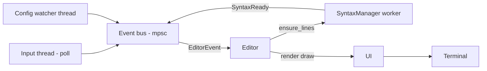

### Event-driven incremental syntax pipeline

Legend:

- Single worker parses full buffer; incremental reparse attempted for single
  contiguous edits (tree.edit) else full parse.
- highlight_version guards against stale results.
- Per-line states: Uninitialized -> Pending -> Ready (reuse spans while Pending) -> Stale.

Mermaid (rendered):

```mermaid
flowchart LR
  Editor[Editor] -->|ensure_lines (batch)| Worker[SyntaxManager worker]
  Worker -->|Parse+Extract global spans| Worker
  Worker --> ReadyEvent[SyntaxReady event]
  ReadyEvent --> Editor
  Editor -->|poll_results| Update[Update line states]
  Update --> Redraw[RedrawRequest]
```

### Window layout and splits (example)

Mermaid (rendered):

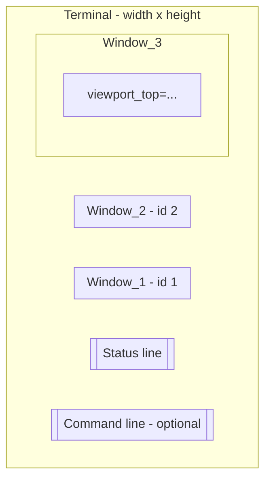

Legend:

- Reserved rows = status line + optional command line.
- Each window tracks viewport_top and horiz_offset independently.
- Active window id controls cursor-line highlight.

### Rendering: gutter, wrapping, and highlights

Mermaid (rendered):

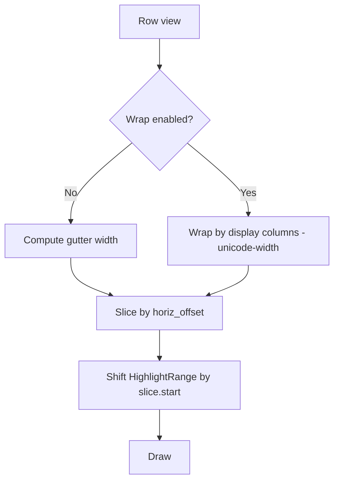

Legend: '#' = gutter (numbers/marks), '|' = column boundary

Notes:

- Wrap width is measured in display columns (unicode-width), not bytes.
- Highlight ranges are byte-based; shifting occurs after safe slicing.

### Per-line syntax state transitions

Legend:

- Ready spans reused while line Pending prevents flicker.
- Stale marks schedule prioritized refresh.

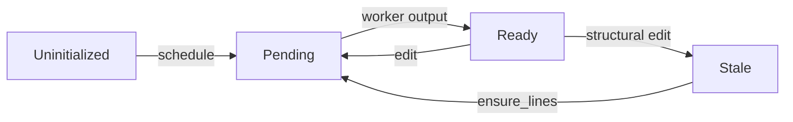

### Buffer close (MRU fallback) sequence

Mermaid (rendered):

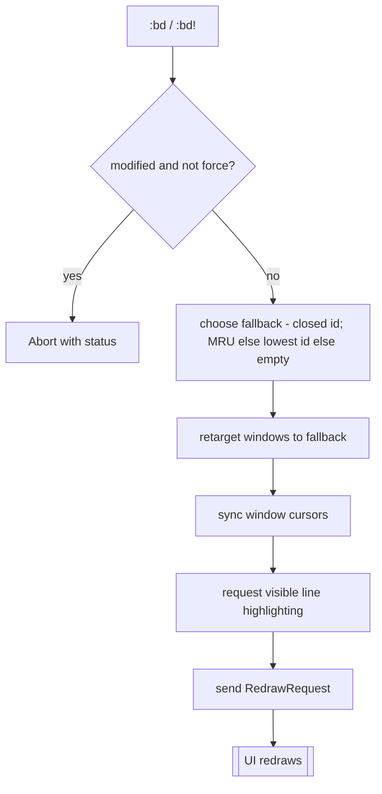

### RenderState diff and redraw decision (hybrid strategy)

Mermaid (rendered):

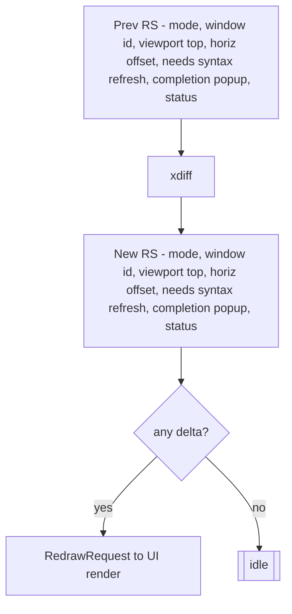

### Terminal frame diff engine invariants

The on-screen rendering path is unified behind a shadow frame diff engine. Understanding
its invariants is important when adding new UI elements or terminal operations.

Core concepts:

- FrameBuffer: fixed-size (w x h) array of `Cell { ch, fg: Option<Color>, bg: Option<Color> }`.
  Each frame capture starts with a new buffer cleared to the editor background.
- Double buffering: `begin_frame()` allocates the current frame and toggles the terminal into
  capture mode. All subsequent "queue" APIs mutate the frame (cells + cursor meta) instead of
  writing escape sequences. `flush_frame()` diffs against the previous frame and emits the minimal
  set of changes, then stores the finished buffer as `prev_frame`.
- Logical scroll optimization: before a new capture begins, `scroll_prev_frame_region` can shift a
  rectangular region of the previous frame up or down, blanking the exposed rows. This preserves
  cell equality for scrolled lines so the diff treats them as unchanged.

Mermaid (rendered):

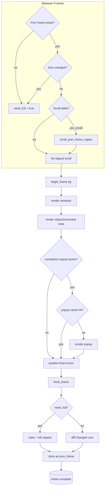

Note: Edge label `yes_small` represents the branch where a scroll delta exists and is within the small-threshold heuristic for logical row shifting.

Invariants (must hold to guarantee flicker-free, minimal rendering):

1. Single writer: Only the renderer (via queue_* APIs) mutates frame contents between `begin_frame`
   and `flush_frame`. Direct terminal writes during capture are forbidden (APIs are crate-private).
2. Deterministic full coverage: Every visible UI element overdraws its region each frame capture.
   No reliance on implicit previous contents (except via explicit scroll shifting step which is
   performed before capture). When an element disappears (e.g. popup), underlying window content
   has already been rendered in the current frame, so diff restores it without clears.
3. No proactive clears: Terminal clear / clear line escape sequences are only issued in a forced
   full repaint path (initial frame, resize, or explicit `invalidate_previous_frame`). Regular
   updates rely solely on cell diffs. Adding new code must not call raw clear operations.
4. Color stability: The diff engine tracks the active fg/bg and only emits `ResetColor` + new fg/bg
   when a run's attributes differ, reducing attribute churn. Any direct color escape outside this
   pattern would desynchronize the tracker.
5. Cursor atomicity: Cursor is hidden at diff start and only shown (and style changed) after all
   cell updates are flushed, preventing partial-frame cursor flicker.
6. Full repaint trigger: A change in terminal dimensions or explicit invalidation sets `need_full`.
   A full repaint starts with a single `ClearType::All` followed by grouped runs; subsequent frames
   revert to diffs automatically once dimensions stabilize.
7. Headless mode: When `is_headless()` (tests), queue APIs become no-ops while still updating the
   FrameBuffer so logic (layout, caching decisions) can be validated without terminal side-effects.
8. Popup caching: Transient overlays (e.g. completion popup) may short-circuit rendering if a hash
   of (content, geometry, theme version) matches previous frame. Skipping a popup draw MUST still
   allow underlying content to appear correctly; thus the popup is always rendered after windows.
9. Markdown preview incremental diff: Per-line content hashes enable in-place line replacement and
  selective highlight regeneration. Structural changes (length mismatch) fall back to full rebuild.

Extension guidelines:

- New transient UI (tooltips, registers, etc.) should either: (a) fully overdraw their region every
  frame capture, or (b) implement a cache with an early return using immutable inputs hash. Never
  partially rely on previous frame cells unless using the sanctioned scroll shifting API.
- If adding new cell attributes (e.g., underline), extend `Cell` plus diff run grouping; avoid ad-hoc
  escape writes inside rendering loops.
- For animations, prefer mutating cells over intermittent clears; let diff handle minimal updates.

Failure modes & detection:

- Visual flicker: usually indicates a rogue clear or direct stdout write during capture.
- Color bleeding: typically caused by emitting SetForeground/Background outside diff's state
  machine without resetting tracked `active_fg/bg`.
- Missing restored content after popup dismiss: implies popup was drawn before underlying windows
  or windows skipped painting that region.

Testing hooks:

- `debug_ops()` instrumentation counts queued escape ops (approximate). Cache effectiveness tests
  assert a second identical frame produces fewer ops.
- Headless mode in tests ensures logical equality/diff correctness without terminal interaction.

These invariants aim to keep the renderer predictable, minimal, and flicker-free.

### Buffer switch/bind flow

Mermaid (rendered):

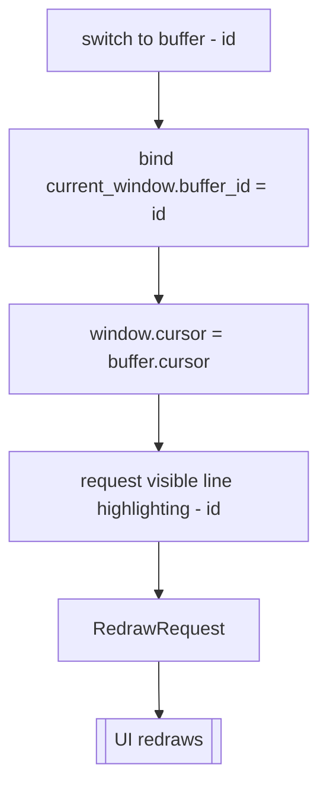

### Viewport motions (zz / zt / zb)

Mermaid (rendered):

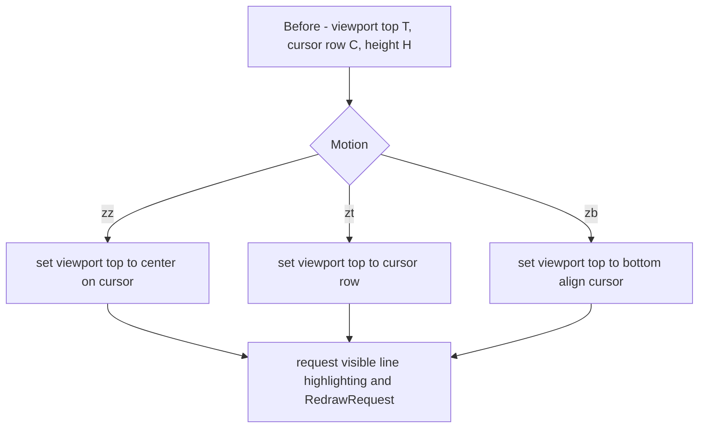

### Ex command pipeline with completion

Mermaid (rendered):

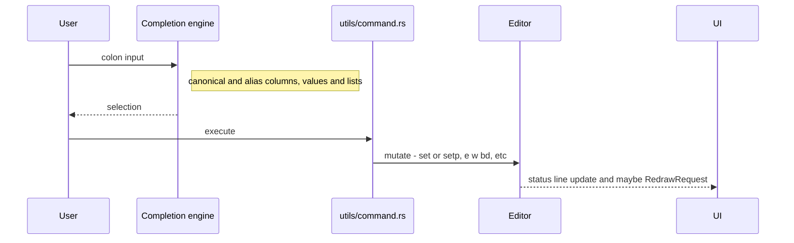

Notes:

- The completion engine is modular (engine + presenter + providers).
  Providers gather items; the presenter normalizes/filters/sorts; the engine
  maintains UI state and accept behavior.
- See docs/COMPLETION.md for the detailed rules and a sequence diagram of the
  flow.

#### Component overview (completion)

Mermaid (rendered):

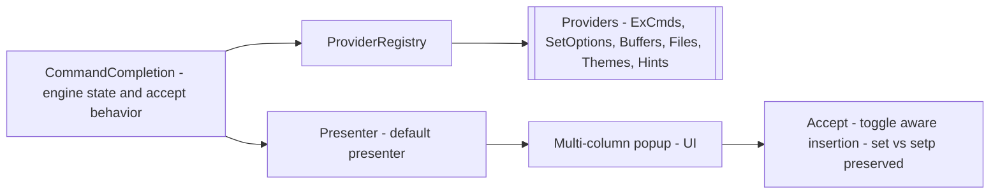

### Config hot-reload path

Mermaid (rendered):

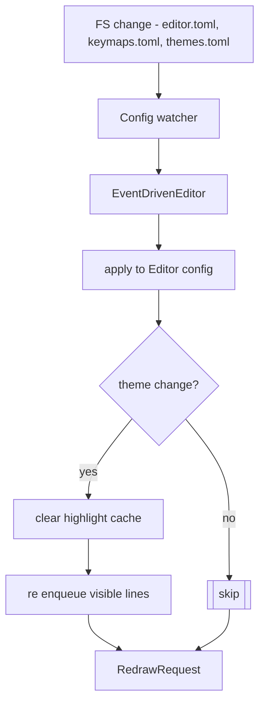

## FAQs

- Why don’t I see highlights immediately?
  - Editor enqueues work for visible lines and renders right away; highlights
    appear on the next redraw when results arrive from the worker.

- How are stale highlight results prevented from flashing?
  - Each request carries a version. The dispatcher drops results older than
    Editor.highlight_version, so only the latest context applies.

- Does the cache lead to stale colors after theme change?
  - The cache is cleared on theme update; visible lines are re-enqueued with a
    new version and repainted.

## Glossary

- Editor: Central orchestrator (core/editor.rs) managing buffers, windows,
  UI, input, search, macros, and async syntax.
- Buffer: In-memory file/text model (core/buffer.rs) with lines, cursor,
  selection, undo/redo, marks, clipboard.
- Window/WindowManager: Split layout and per-window viewport/horizontal
  offset control (core/window.rs).
- UI/Renderer: Drawing logic over the Terminal; renders buffers,
  status/command lines, highlights (ui/renderer.rs).
- Terminal: Thin wrapper over crossterm for buffered terminal IO
  (ui/terminal.rs).
- EventDrivenEditor: Runtime that spawns input, config watcher, syntax
  dispatcher threads and processes EditorEvents (input/event_driven.rs).
- Event bus: mpsc::Sender/Receiver channel that carries typed EditorEvent
  enums among threads.
- Input thread: Polls crossterm events at EVENT_TICK_MS, converts to
  InputEvent, sends to the bus.
- Config watcher: Watches editor/keymap/theme files, emits ConfigEvent;
  blocks on filesystem notifications (config/watcher.rs).
- AsyncSyntaxHighlighter: Background worker + cache managing per-line
  highlights using Tree-sitter (features/syntax.rs).
- SyntaxHighlighter: Per-thread parser/theme that computes HighlightRange
  values from text (features/syntax.rs).
- HighlightRange: Byte range [start,end) with a HighlightStyle applied by the
  renderer.
- Priority: Scheduling hint for syntax requests: Critical (cursor), High
  (visible), Medium/Low (nearby/background).
- highlight_version: Atomic counter on Editor; bumps invalidate in-flight
  syntax results to avoid stale flashes.
- LRU cache: Small per-line highlight cache in AsyncSyntaxHighlighter keyed by
  (buffer_id, line_index) with fixed capacity.
- WorkItem: A syntax job: buffer_id, line_index, full_content, language,
  priority, version.
- HighlightResult: Output of the worker for a single line; validated by
  dispatcher then cached.
- RenderState: Compact snapshot in EventDrivenEditor for change detection
  between redraws.
- EditorRenderState: Full state passed to UI::render (buffers shown, layout,
  highlights, status, config).
- Mode: Editor mode (Normal, Insert, Replace, Visual, VisualLine,
  VisualBlock, Command, Search, OperatorPending).
- Selection: Visual selections or operator ranges tracked with line/column
  positions.
- Viewport/horiz_offset: Vertical top row and horizontal column offset used
  for rendering visible slices.
  - RenderState includes the current window id, viewport_top, and
    horiz_offset so viewport-only changes (e.g., zz/zt/zb, horizontal
    scroll) trigger redraws even when the cursor doesn’t move.
- Gutter: Left column for line numbers and/or marks; width computed per
  buffer length and settings.
- Wrap: Grapheme-aware wrapping of logical lines into multiple rows within a
  window’s content width.
- ThemeConfig/UITheme/SyntaxTheme: Theme system loaded from themes.toml; UI
  colors and syntax mappings.
- CommandCompletion: Command-line completion engine for : commands and paths
  (features/completion::engine). See docs/COMPLETION.md for behavior and
  architecture details.
- SearchEngine: Text search subsystem with case sensitivity and smartcase
  (features/search.rs).
- MacroRecorder: Records/plays macros via registers (features/macros.rs).
- TextObjectFinder: Finds text object ranges for operators
  (features/text_objects.rs).
- LSP (stub): Scaffold for Language Server Protocol client integration
  (features/lsp.rs).
- crossterm: Terminal input/output library used for events and rendering.
- tree-sitter: Incremental parsing library used to power syntax highlighting.
- crossbeam-channel/std::mpsc: Channels used for async pipelines and event
  bus communication.
