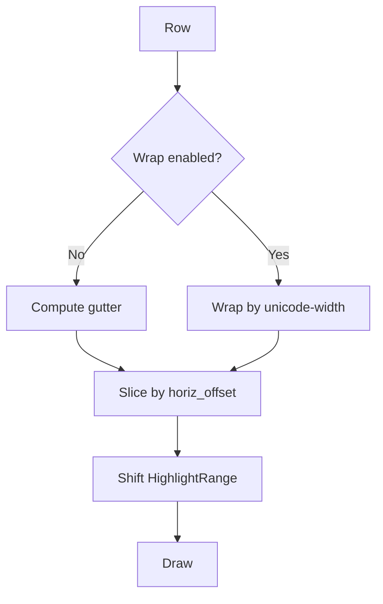

# Oxidized Architecture Quickstart (At a Glance)

This one-pager gives a fast visual overview of how Oxidized fits together.
See [ARCHITECTURE.md](./ARCHITECTURE.md) for full details. Diagrams use
Mermaid.

## Core ideas

- Editor orchestrates buffers, windows, UI, input, search, macros, and the
      event-driven incremental syntax manager.
- Event-driven runtime: background threads send typed events; the main loop
      reacts and renders.
- UI renders a snapshot (EditorRenderState) and uses per-line Ready spans; Pending lines reuse previous spans (no flicker).
- Incremental syntax highlighting runs in a single worker thread (SyntaxManager) that parses the full buffer, attempts incremental reparses, slices requested lines, and emits SyntaxReady events (no dispatcher/LRU layer).
- Visual selection is anchor-oriented: `Selection.start` is the anchor and is
      not always ordered before `end`. Helpers derive ordered spans; this
      preserves direction for motions.

## Event-driven threads and event bus

Legend:

- Boxes = components/threads; arrows = messages.
- mpsc = std::sync::mpsc for EditorEvents.
- RedrawRequest -> Editor::render -> UI draws to Terminal.

Mermaid (rendered):

```mermaid
flowchart LR
      Input[Input thread (poll)] --> Bus[Event bus (mpsc)]
      Config[Config watcher thread] --> Bus
      Bus -->|EditorEvent| Editor
      Editor -->|ensure_lines| Worker[SyntaxManager worker]
      Worker -->|SyntaxReady| Bus
      Editor -->|render() draw| UI[UI]
      UI --> Terminal[Terminal]
```

## Incremental syntax highlighting pipeline

Legend:

- Single worker parses full buffer; incremental reparse on single contiguous edits (tree.edit), else full parse.
- highlight_version guards against stale results; main thread drops outdated spans.
- Per-line states (Uninitialized/Pending/Ready/Stale) replace external LRU cache; Ready spans reused while Pending prevents flicker.

Mermaid (rendered):

```mermaid
flowchart LR
      Editor[Editor] -->|ensure_lines (batch)| Worker[SyntaxManager]
      Worker --> Ready[SyntaxReady event]
      Ready --> Editor
      Editor -->|poll_results; update line states| Redraw[RedrawRequest]
```

## Window layout (example)

Legend:

- Reserved rows: status line + optional command line.
- Each window has its own viewport_top and horiz_offset.

Mermaid (rendered):

```mermaid
flowchart TB
      subgraph Term[Terminal (W x H)]
            subgraph W1[Window 1]
            end
            subgraph W2[Window 2]
            end
            subgraph W3[Window 3]
            end
            Status[[Status line]]
            Cmd[[Command line (optional)]]
      end
```

## Rendering: gutter, wrapping, and highlights

Legend:

- '#' = gutter; '|' = column edge; highlights are byte ranges per line.
- Wrap width uses display columns (unicode-width), not bytes.

Mermaid (rendered):



## Compact glossary

- Editor: Central orchestrator; produces EditorRenderState for UI.
- Buffer: Text, cursor, selection, undo/redo, marks, clipboard.
- Window/Manager: Splits and per-window viewport/horizontal scroll.
- UI/Terminal: Renderer and crossterm-backed terminal IO.
- EventDrivenEditor: Spawns input/config/syntax threads; main event loop.
- Event bus: mpsc channel carrying EditorEvent enums.
- SyntaxManager: Single worker + per-line state machine (Uninitialized/Pending/Ready/Stale).
- ensure_lines: Batches visible (and nearby) line scheduling.
- SyntaxReady: Event indicating new/updated spans ready for polling.
- highlight_version: Atomic counter; stale versions ignored.
- Per-line state reuse: Ready spans reused while Pending; no separate LRU.

## Testing (snapshot)

- Fast, mostly unit-style integration tests in `tests/` (sub‑second).
- Coverage buckets: buffer edits, motions (`gE`/`ge`, word/WORD), visual +
      select modes & wrapped selections, text objects, search, macros,
      keymaps/events, commands & config persistence, UI/status/wrap/layout,
      completion, replace/paste, window mgmt, grapheme safety.
- Motion pattern: baseline, punctuation, cross-line, start-of-buffer,
      repetition.
- Add regressions by appending to existing domain file; short `//!` doc
      comment when needed.
- Run all: `cargo test`  |  Focus: `cargo test ge_`  |  Single: `cargo test
      --test g_motion_tests ge_hyphen_treated_as_separate_word`
- Lint gate: `cargo clippy -- -D warnings`.

---

See the complete guide: [ARCHITECTURE.md](./ARCHITECTURE.md)

## Registers (Phase 2)

Implemented:

- Unnamed register (") as default source/target for yank/delete/put.
- Named registers a-z; A-Z appends to lowercase.
- Numbered registers: 0 holds the last yank; 1..9 rotate on line-wise
      deletes/changes (most recent in 1).
- Small delete register (-): character-wise deletes/changes (x, dw when not
      spanning lines) write here.
- Black-hole register (_): discards writes.
- One-shot prefix '"{register}': select a register for the next read/write.

> Tip
>
> Use the black-hole register to avoid clobbering your clipboard while
> deleting/changing:
>
> - "\_ dd deletes the current line without updating any register.
> - "\_ dw deletes a word and discards it.
> - Works with counts and motions: e.g., "\_ 3dd, "\_ d$.

Implemented extras:

- :registers (alias :reg) opens a read-only [Registers] scratch buffer with
      current register contents.

Next phases: optional system clipboards (+, *).
