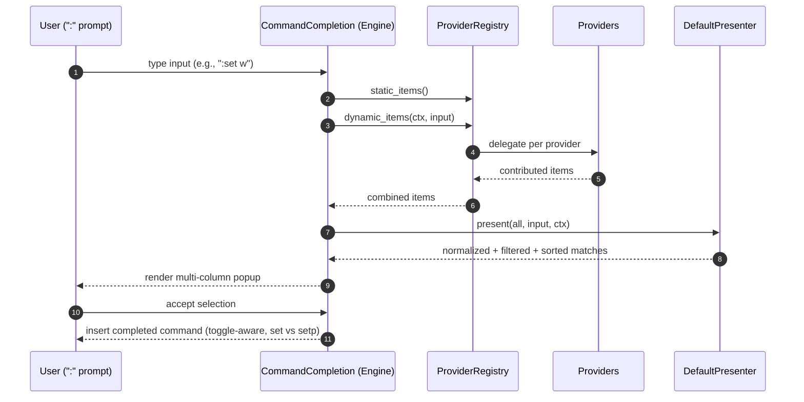

# Command-line Completion in Oxidized

Oxidized provides a modern, multi-column completion popup at the ":" prompt
with context-aware behavior tailored for everyday use.

## Overview

Columns (left to right):

- Action/Key: The command or option you’ll run if you accept the row. For
  booleans this is action-oriented (e.g., shows `nowrap` when wrapping is
  currently enabled to indicate the toggle you’d perform now).
- Alias/Opposite: The common short alias (e.g., `smk`) or the opposite boolean
  form to aid discoverability (e.g., `wrap` alongside `nowrap`).
- Current: Bracketed current value or state, e.g., `[true]`, `[4]`, or the
  active theme name.
- Description: Concise, canonical explanation of the action/option.

The popup width is computed dynamically to fit your terminal and the content;
the height is configurable via `interface.completion_menu_height` in
`editor.toml`.

## Behavior & Rules

- Prefix preservation: If you start with `:setp`, suggestions use the `setp`
  prefix (with a trailing space); if you start with `:set`, suggestions use
  the `set` prefix (with a trailing space).
- Canonicalization: Aliases are deduplicated under the canonical name; you
  won’t see both `showmarks` and `smk` as separate rows.
- Negative and query forms:
  - Negative (`no…`) forms are only suggested when you begin your input with
    `:set no…`.
  - Query forms (`:set option?`) aren’t suggested unless you actually type the
    trailing `?`.
- Positional values, not `=`: Value-taking options are suggested with a space
  (e.g., `:set tabstop 2`). Supported dynamic suggestions include common
  values for `tabstop`, `scrolloff`, `sidescrolloff`, `timeoutlen`,
  `undolevels`, boolean `percentpathroot true|false`, and enumerated
  `colorscheme` names (from `themes.toml`).
- File paths: `:e` / `:w` path completion honors `%` as the current buffer
  directory when `interface.percent_path_root` is enabled.

## Boolean Toggles (Action-Oriented)

Oxidized’s boolean suggestions display the action you’ll take now based on the
current state. For example:

- If wrapping is currently enabled, you’ll see `nowrap` in the first column
  (alias column shows `wrap`). Accepting it inserts `set nowrap` (or `setp
  nowrap` if you started with `setp`).
- If wrapping is disabled, you’ll see `wrap` in the first column (alias shows
  `nowrap`). Accepting inserts `set wrap` or `setp wrap` accordingly.

This reduces mental overhead and avoids having to remember the current state
before toggling.

## Differences from Vim

- `:setp` (persist) is Oxidized-specific: it mirrors `:set` suggestions but
  writes changes back to the TOML configuration files.
- Action-oriented booleans: the item you choose is the toggle you’ll perform
  now; Vim’s completion doesn’t adjust suggestions based on current values.
- Canonicalized list: aliases are collapsed to the canonical name with alias
  hints shown separately; Vim typically lists both.
- Cleaner defaults: we hide `no…` and `?` variants unless you steer toward
  them, reducing noise.
- Positional value guidance: suggestions prefer `:set option <value>` to `:set
  option=<value>` for clarity.
- Rich multi-column UI: themed columns for key/alias/current/description with
  dynamic width.

## Architecture Overview

The completion system is split into three layers:

- Providers: Small, focused sources that contribute items (ex commands, :set
  options, buffers, files, themes, numeric/boolean hints). They’re registered
  into a central registry; adding a new provider doesn’t require changes in
  the engine.
- Presenter: A shaping layer that normalizes aliases (e.g., `smk` →
  `showmarks`), filters negatives and query forms based on input, and sorts/
  deduplicates. It’s independent of data sources.
- Engine: Orchestrates providers and presenter, maintains UI state (active,
  matches, selection), and implements accept behavior (e.g., boolean toggling
  and `set` vs `setp`).

This separation keeps data acquisition (providers) and display logic
(presenter) clean and testable.

### Diagram

## Examples

- Toggle wrapping: type `:set wrap` and press `<Tab>` — the popup shows either
  `wrap` or `nowrap` based on your current state, with the opposite in the
  alias column.
- Set tab width: `:set ts` (then space) offers `2`, `4`, `8` suggestions;
  `:setp ts 4` persists the choice.
- Choose a theme: `:set colorscheme` (then space) lists names from
  `themes.toml` with descriptions.
- Use buffer-rooted paths: `:e %/src` lists files under the current buffer’s
  directory when `percent_path_root` is enabled.

## Troubleshooting

- No suggestions? Ensure you’ve typed a space after the command (e.g., `:set`
  then a space) when expecting value/option completions.
- Seeing `no…` forms too often? They only appear when you begin with `:set
  no`; otherwise they’re hidden.
- Want queries? Type `?` explicitly, e.g., `:set wrap?`.

If you find gaps or have suggestions, please open an issue with a screenshot
and the exact input you typed.
